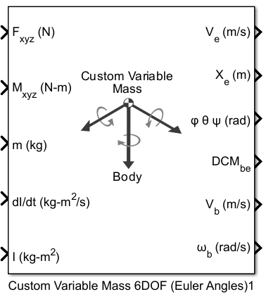

# 6DOF GNC Simulation (Simulink/C++)

A high-fidelity 6-DOF (Six-Degrees-of-Freedom) simulation of a Falcon 9-like launch vehicle's atmospheric flight phase, from launch pad to stage separation. Features a complete Guidance, Navigation, and Control system written in C++ that runs in a co-simulation environment with a detailed physics model built in Simulink.


1. [Overview & Architecture](#overview--architecture)
2. [The Simulation Model (Simulink)](#the-simulation-model-simulink)
   - [6-DOF Physics Engine](#6-dof-physics-engine)
   - [Variable Mass & Gravity Model](#variable-mass--gravity-model)
   - [Aerodynamics Model](#aerodynamics-model)
   - [UDP Send/Receive](#udp-send-receive)
3. [Flight Software (C++)](#the-flight-software-c)
   - [State Machine](#state-machine)
   - [Communication](#state-machine)
   - [Guidance](#guidance)
   - [Navigation & Control](#navigation--control)
4. [Monte Carlo Analysis](#monte-carlo-analysis)
5. [How to Run](#how-to-run)


## Overview & Architecture
The goal of the project is to simulate a symmetrical, aerodynamically instable rocket up until stage seperation. It is architected as a co-simulation environment that seperates the vehicles physics from its control logic. Communication between Simulink and the Flight Software is handled via UDP.

1.  **Plant Model (Simulink):** 6-DOF simulation that models and calculates all major forces and moments acting on the rocket, including engine thrust, gravity, and a realistic aerodynamics model. It serves as the physics engine and is also responsible for visualization using Simulink 3D Animation.

2.  **Flight Software (C++):** The standalone C++ application runs the entire GNC system. It processes incoming sensor data from the Simulink model via UDP, guides and steers the rocket using PID controllers and a predefined flight config.

Together they create a Software-in-the-Loop environment that allows rapid development and testing of both components.

The control objective is to guide the vehicle through a **gravity turn**. The GNC system is responsible for full **attitude control** to maintain stability, especially during Max Q, while actively compensating for variable disturbances like wind.

The simulation was verified using Monte-Carlo-Analysis to simulate 100 runs with different variables, proving that the flight software is able to adapt to different situations.

## Simulation Model (Simulink)

#6-DOF Physics Engine


I use the 6DOF Block Custom Variable Mass block from the Aerospace Toolset.
This subsystem is responsible for calculating the total forces and moments applied to the vehicle's body frame based on actuator commands from the GNC software. 
Yaw and gimbal input angles are in radians. The input for the roll thrusters is a value between 0 and 1 (0% thrust - 100% thrust). As I'm simulating a single engine first stage, I have to use thrusters with unrealistically high thrust. In reality roll control would of course come from the main engines, this is just a simplification.

My thrust profile is a simple Matlab function, the inputs being time, ambient air pressure and engine_status.
```matlab
function F = thrust_profile(t, P_ambient, engine_status)
    % Data for Merlin 1D (9x)
    Isp_vac = 311;      
    Isp_sl  = 282;
    P_sl    = 101325;
    g0      = 9.80665;  
    burn_time = 200;    
    mass_flow = 2500;
    % engine_status = engine on/off
    if t < burn_time && engine_status
        Isp_current = Isp_vac - (Isp_vac - Isp_sl) * (P_ambient / P_sl);
        F = Isp_current * mass_flow * g0;
    else
        F = 0;
    end
    
end
```
Using linear interpolation we can get the rough ISP numbers for each altitude based on the atmospheric pressure.

#Vehicle Mass & Gravity Model
```matlab
function M = variable_mass(t)
wet_mass = 549054;
mass_flow_rate = 2500;
M = wet_mass - (mass_flow_rate * min(t,200));
end
```
mass = wet mass of a fully fueled Falcon 9 subtracted by sim time * flow rate of nine Merlin-1D engines.
```matlab
function [I, dIdt] = build_calculator(m, m_flowrate, initial_mass, initial_I_pitch_yaw)
    roll_inertia_factor = 0.05;

    I_pitch_yaw = initial_I_pitch_yaw * (m/initial_mass);
    I_roll = I_pitch_yaw * roll_inertia_factor;
    I = diag([I_roll, I_pitch_yaw, I_pitch_yaw]);

    % Calculating dI/dt
    dI_pitch_yaw_dt = (initial_I_pitch_yaw/initial_mass) * (-m_flowrate);
    dI_roll_dt = roll_inertia_factor * dI_pitch_yaw_dt;

    dIdt = diag([dI_roll_dt, dI_pitch_yaw_dt, dI_pitch_yaw_dt]);
end
```
The pitch and yaw moments of inertia (Iyy, Izz) are scaled linearly with the current vehicle mass to account for fuel consumption. They are diagonal matrices, as we assumed the rocket is perfectly symmetrical.

For gravity we just multiply mass*g with the DCM_be (Direction to Cosine Matrix, from earth centered to body frame). The DCM_be is an output of the 6DOF block.
```gravity = DCM *mg;```
This is the entire input side of the Simulink model, excluding aerodynamics, which we will get to now:

#Aerodynamics Model
First, we calculate the alpha and beta angles using this function:
```
function [alphabeta, Airspeed]= fcn(V_wind, V_in, DCM_be, t)
V_rel_World = V_in - V_wind;
V_rel_Body = DCM_be * V_rel_World;

u = V_rel_Body(1);
v = V_rel_Body(2);
w = V_rel_Body(3);

V_a = norm(V_rel_Body); %Airspeed body

alpha_new = atan2(w,u);
persistent alpha_old;

if isempty(alpha_old)
        alpha_old = alpha_new; 
end

if V_a < 1e-6
    beta = 0;
else
    beta = asin(v/V_a);

end
alpha = 0.9 * alpha_old + 0.1 * alpha_new; % simple low pass filter
alpha_old = alpha;
alphabeta = [alpha,beta];
Airspeed = V_a;
end
```
